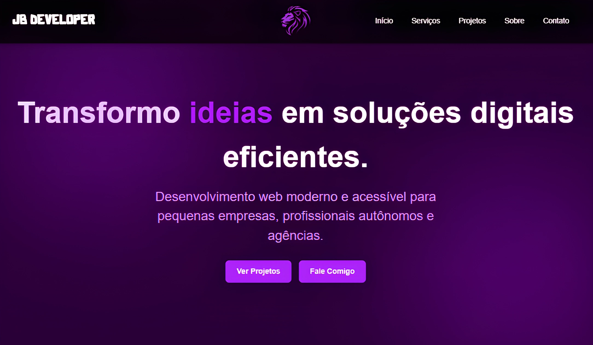

# 🚀 Portfólio Pessoal — JB Developer

Este é o repositório do meu portfólio pessoal como desenvolvedor front-end, criado com foco em performance, design moderno e responsividade. O projeto tem como objetivo apresentar minhas habilidades, experiências e serviços de forma profissional e atrativa para potenciais clientes e recrutadores.



## 🛠️ Tecnologias Utilizadas

- ⚛️ [React.js](https://reactjs.org/)
- 🟦 [TypeScript](https://www.typescriptlang.org/)
- 🎨 [Tailwind CSS](https://tailwindcss.com/)
- 💅 [styled-components](https://styled-components.com/)
- 🎞 [Framer Motion](https://www.framer.com/motion/)
- ⚡ [Vite](https://vitejs.dev/)
- 🧪 [Vitest](https://vitest.dev/)
- 📩 [EmailJS](https://www.emailjs.com/)
- 🧹 Eslint + Prettier

---

## 📁 Estrutura do Projeto

```
src/
├── assets/            # Imagens e ícones
├── components/        # Componentes reutilizáveis
├── pages/             # Páginas principais
├── styles/            # Tema, global styles e breakpoints
├── hooks/             # Custom hooks
├── utils/             # Funções utilitárias
├── App.tsx            # Componente raiz
└── main.tsx           # Entry point
```

---

## 🧪 Rodando Localmente

```bash
# Clone o repositório
git clone https://github.com/birajnior/update-portfolio.git

# Acesse a pasta
cd update-portfolio

# Instale as dependências
npm install

# Inicie o servidor de desenvolvimento
npm run dev
```

---

## 📦 Build de Produção

```bash
npm run build
```

---

## 📌 Funcionalidades

- Design moderno e responsivo
- Seções com animações suaves via framer-motion
- Navbar inteligente (aparece ao subir, oculta ao descer)
- Temas e cores centralizados em `theme.ts`
- Breakpoints reutilizáveis via `media.ts`
- Código modular e escalável

---

## 📩 Envio de Formulário de Contato

- Integração com [EmailJS](https://www.emailjs.com/) para envio de mensagens diretamente pelo formulário, dispensando backend próprio
- Validação robusta dos campos: nome, email, telefone (com máscara), mensagem e preferência de contato
- Feedback visual ao usuário por meio de modais personalizados de sucesso e erro
- Estilização dos inputs, textarea e select via [styled-components](https://styled-components.com/) com paleta de cores do tema
- Tratamento assíncrono do envio com controle do estado de loading para melhor UX

---

## 📸 Demonstração

👉 Em breve no ar: [https://jbdeveloper.com.br](https://jbdeveloper.com.br)

---

## 🤝 Contribuições

Projeto pessoal, não aberto para contribuições externas neste momento. Sugestões e feedbacks são bem-vindos via Issues.

---

## 📄 Licença

Distribuído sob a licença MIT. Veja o arquivo `LICENSE` para mais informações.

---

## 📬 Contato

- Instagram: [@birajnior](https://instagram.com/birajnior)
- LinkedIn: [Ubiratan Bernardo](https://linkedin.com/in/ubiratanbernardo)
- Portfólio: [jbdeveloper.com.br](https://jbdeveloper.com.br)

---

> Projeto em constante evolução 🚧 — acompanhe para novidades!
